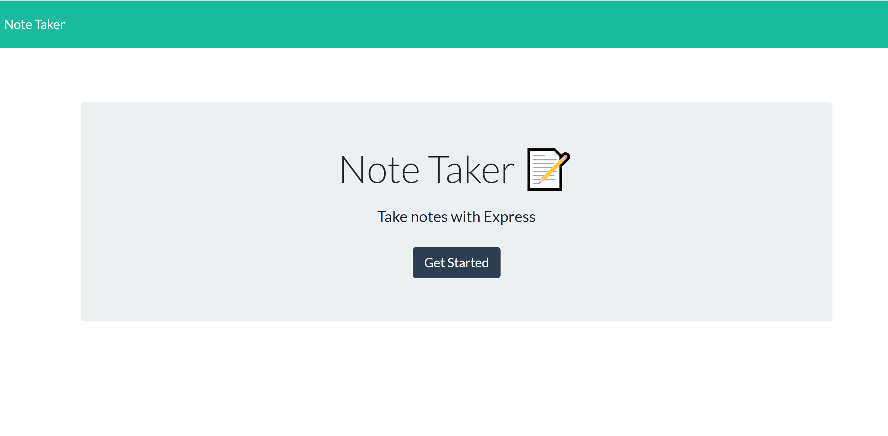
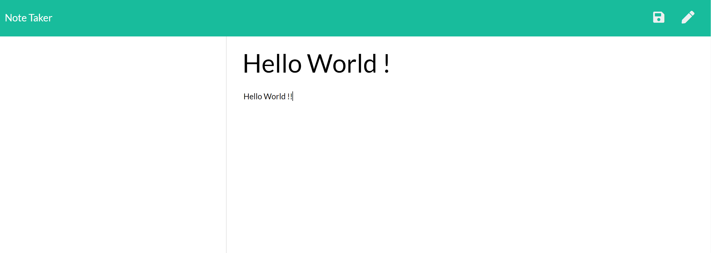
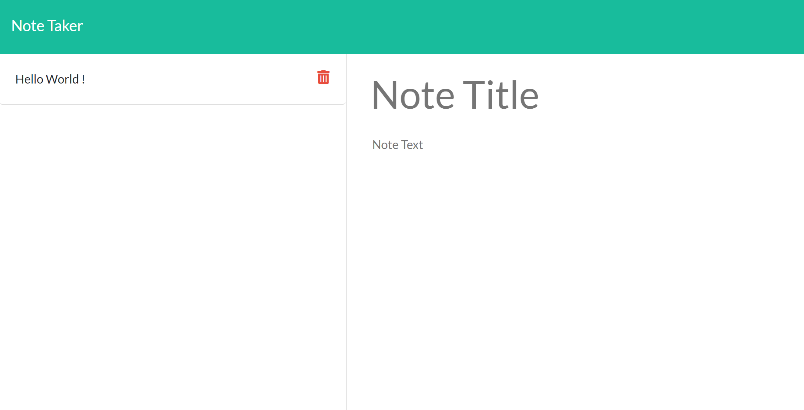

# Note Taker

This application that can be used to write, save, and delete notes. This application use an express backend and save and retrieve note data from a JSON file.

## Link to Application

Follow [this link](https://note-taker-apps.herokuapp.com/) to view the application.

## Screenshots

### Desktop

## Getting Started

Clone the repository or download and unpack the source code of the project. From the project folder, open the `app.js` and run `node app.js`

## Running the Application

- Click on "Note Title" to add note's title.
- Click on "Note Text" to add note's text.
- To clear the note without saving, click on the pen icon at the top right corner of the page.
- When both title and text is added, save button with disc icon will appear next to clear button.
- Click on it to save the note.
- To delete note, click on the delete button next to note title in the left panel.

## Built With

- Javascript
- Node.js
- Express
- JSON
- ES6

## Authors

- **Prakriti Rajbhandari** - [PrakritiRajbhandari](https://github.com/PrakritiRajbhandari)

## License

This project is licensed under the MIT License - see the [LICENSE.txt] file for details

## Acknowledgments

- Billie Thompson - [PurpleBooth](https://gist.github.com/PurpleBooth) - [README.md](https://gist.github.com/PurpleBooth/109311bb0361f32d87a2) and [CONTRIBUTING.md](https://gist.github.com/PurpleBooth/b24679402957c63ec426) templates.
